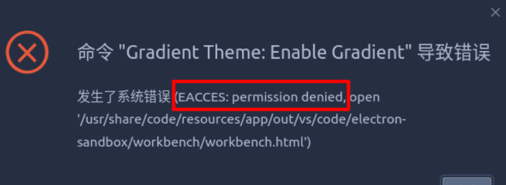

# Gradient Theme

中文文档 | [English](./README.md)

[当前仓库链接](https://github.com/shaobeichen/gradient-theme)，喜欢的话点一个 Star 吧！

# 警告

尽管警告不会影响任何功能，如果你对 VSCode 已损坏警告提示非常介意的话，**不推荐**使用此主题。

如果你不想忽略 VSCode 已损坏警告提示的话，请自己考虑好是否要使用此主题。

老实说，我一开始也是很介意，后来我忽略了已损坏警告提示后，再也不介意了。

# 主题

<table>
    <tr>
        <td>
            <b>Gradient Bearded Theme Arc</b>
            
基于 <a href="https://marketplace.visualstudio.com/items?itemName=BeardedBear.beardedtheme">Bearded Theme Arc</a> ，添加了渐变效果。

        </td> 
        <td>
            <b>Gradient Dracula Theme</b>
            
基于 <a href="https://marketplace.visualstudio.com/items?itemName=dracula-theme.theme-dracula">Dracula Theme</a> ，添加了渐变效果。

        </td> 
    </tr>
    <tr>
        <td></td>
        <td></td>
    </tr>
    <tr>
        <td>
            <b>Gradient Monokai Pro</b>
            
基于 <a href="https://marketplace.visualstudio.com/items?itemName=monokai.theme-monokai-pro-vscode">Monokai Pro</a> ，添加了渐变效果。

        </td> 
        <td>
            <b>Gradient Monokai Pro Classic</b>
            
基于 <a href="https://marketplace.visualstudio.com/items?itemName=monokai.theme-monokai-pro-vscode">Monokai Pro Classic</a> ，添加了渐变效果。

        </td> 
    </tr>
    <tr>
        <td></td>
        <td></td>
    </tr>
    <tr>
        <td>
            <b>Gradient Modern Dark</b>
            
基于 <a href="">Modern Dark</a> ，添加了渐变效果。

        </td>
        <td>
            <b>Gradient Atom One Dark</b>
            
基于 <a href="">Atom One Dark</a> ，添加了渐变效果。

        </td>
    </tr>
    <tr>
        <td></td>
    </tr>
</table>

# 灵感

有一天我看到了一个自已修改 VSCode 主题 CSS 文件的视频，

于是我觉得我可以使用相同的方式来制作一个 VSCode 渐变效果 CSS 文件，

然后我就开始使用 Custom CSS and JS Loader 插件来加载自定义的渐变 CSS，

后来许多人觉得我的渐变主题非常好看，希望也能在自己的 VSCode 上能使用它，

但是如果要使用它的话，需要安装插件还需要我给他们一份 CSS 文件，这太麻烦了！

于是我去学习了如何制作一个 VSCode 主题插件，做出了这个渐变色主题插件。

# 安装

- 在 [ VSCode Marketplace ](https://marketplace.visualstudio.com/items?itemName=shaobeichen.gradient-theme) 安装主题。

  或者

- 在 VSCode 中搜索 Gradient Theme、gradient-theme 关键字后，进行安装。

安装后可以选择基础主题，**此时并没有渐变效果**，如果想要开启渐变效果的话，请看下一步。

**为什么没有直接开启渐变效果呢？**

因为开启渐变效果会对 VSCode 的核心文件进行修改，会有 VSCode 已损坏的警告提示，尽管可以移除警告提示，但还是一部分人不希望这样，在底部会有详细说明。

# 渐变效果

### 开启渐变

你可以通过按 `Ctrl + Shift + P` 或者 `Shift + ⌘ + P` 并选择“**Gradient Theme: Enable Gradient**”来实现此操作。

### 关闭渐变

你可以通过按 `Ctrl + Shift + P` 或者 `Shift + ⌘ + P` 并选择“**Gradient Theme: Disable Gradient**”来实现此操作。

### 重启编辑器

在 开启渐变效果 或 关闭渐变效果 后，会有一条提示，点击重启编辑器后，才能看到渐变效果。

# 请注意

### 1. 忽略已损坏警告提示

请注意，由于开启渐变效果会对 VSCode 的核心文件进行修改，VSCode 会将其解释为核心文件“已损坏”，你可能会在重启编辑器时看到这样一条警告提示，你可以安全地忽略此消息。

如果你不想忽略警告提示的话，请自己考虑好是否要使用此主题。

### 2. 执行 Enable 命令，提示没有权限

如果您是 Windows 用户，您可能需要以管理员权限运行 VS Code。对于 Linux 和 Mac 用户，不得将 Code 安装在只读位置，并且您必须具有写入权限。

### 3. 更新 VSCode

请注意，每次更新 VSCode 后，都需要重复步骤以重新开启渐变效果。

### 4. 更换其他主题

请注意，如果开启了渐变效果，此时你想更换其他主题，最好可以先关闭渐变效果，再选择其他主题，否则渐变主题可能会影响到其他主题的颜色。

# 兼容性

这个主题仍然在不断更新优化。我主要使用 HTML、CSS、JS、TS、Vue、React 等进行开发，因此，虽然这些语言和框架看起来不错，但其他语言和框架可能会出现主题并不合适的情况。如果你发现任何明显的问题，可以提出一个问题，我会尽快解决。

# 如何贡献

很高兴你对这个主题感到兴趣，欢迎任何合适的贡献。

1. Fork 并 Clone 此仓库`git clone https://github.com/<YOUR-USERNAME>/gradient-theme`
2. 为你的更改创建一个分支`git checkout-b my-new-feature`
3. 在 VSCode 中打开*gradient-theme*文件夹
4. 修改你想修改的文件
5. 在 VSCode 中使用 F5 进行调试预览
6. Commit 并 Push 你的修改
7. 提交一份 PR ，请注意并非所有建议都能被接受

# 感谢

感谢 Lun Dev ,让我有了制作这个渐变主题的灵感。 🙏

**[Lun Dev](https://www.youtube.com/@lundeveloper)**

感谢以下主题的作者为开源做出贡献。🙏 我在以下主题的基础上为各个主题制作了渐变效果。

**[Bearded Theme](https://marketplace.visualstudio.com/items?itemName=BeardedBear.beardedtheme)**

**[Dracula Theme Official](https://marketplace.visualstudio.com/items?itemName=dracula-theme.theme-dracula)**

**[Monokai Pro](https://marketplace.visualstudio.com/items?itemName=monokai.theme-monokai-pro-vscode)**

**[Monokai Pro Classic](https://marketplace.visualstudio.com/items?itemName=monokai.theme-monokai-pro-vscode)**
